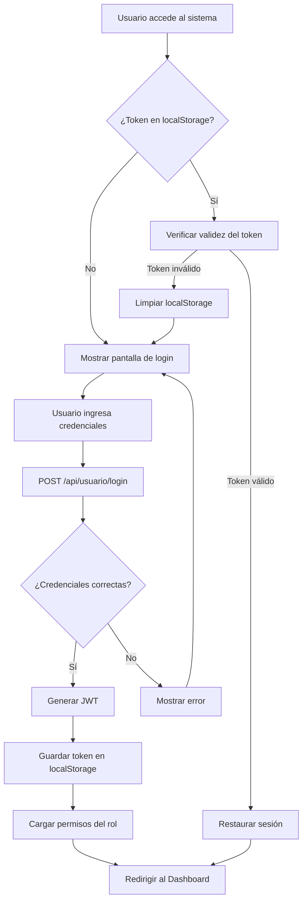
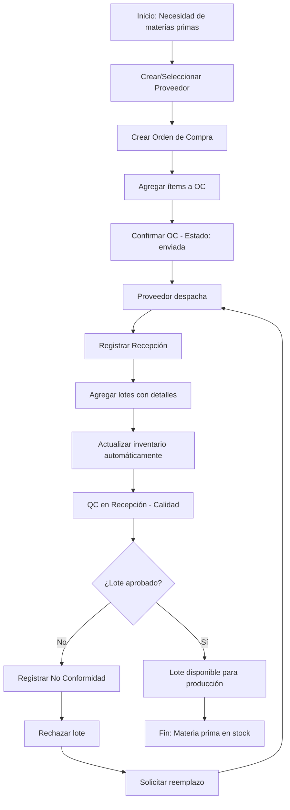
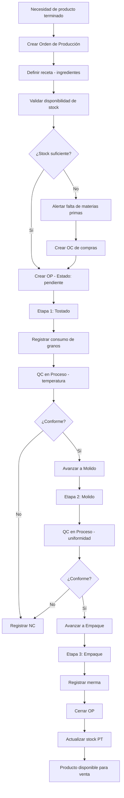
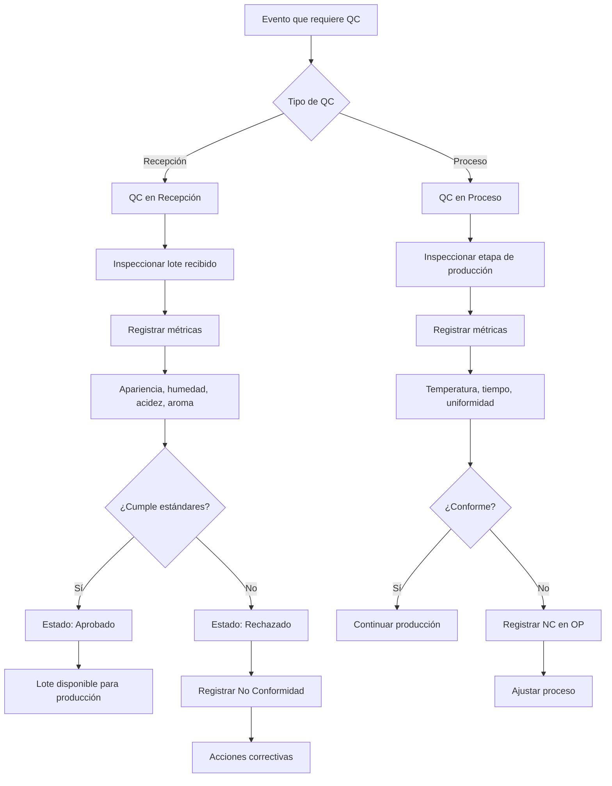
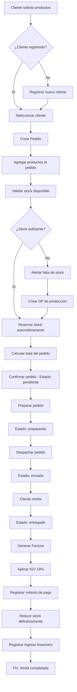
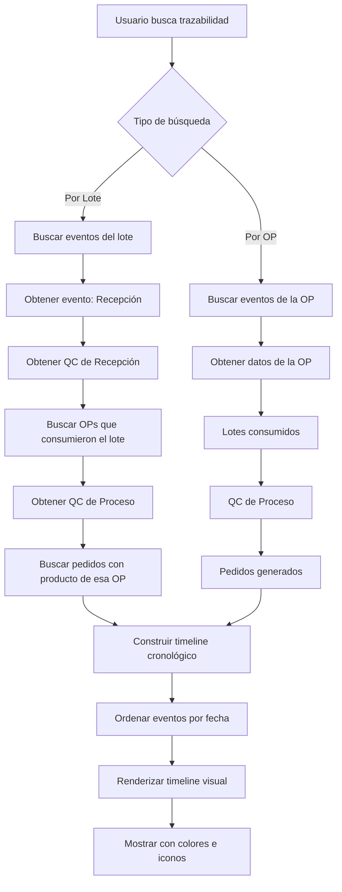
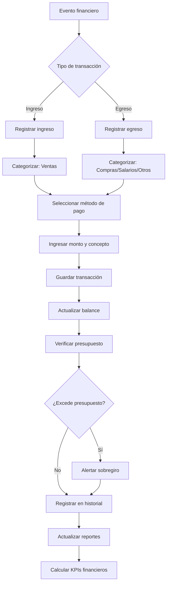
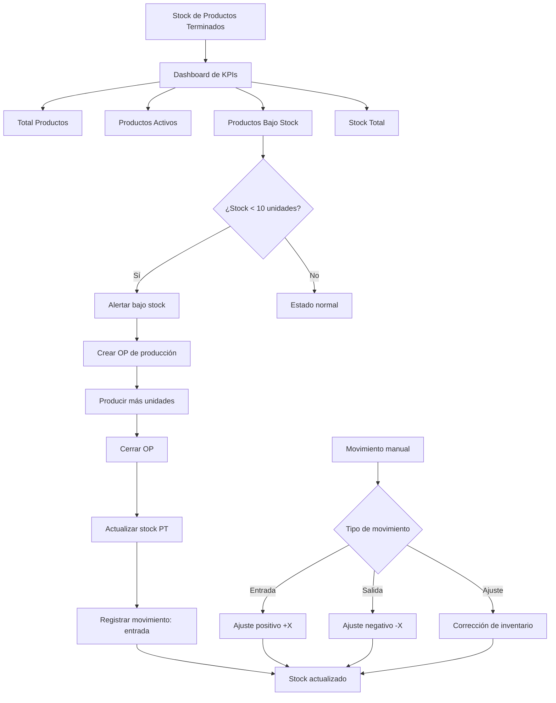
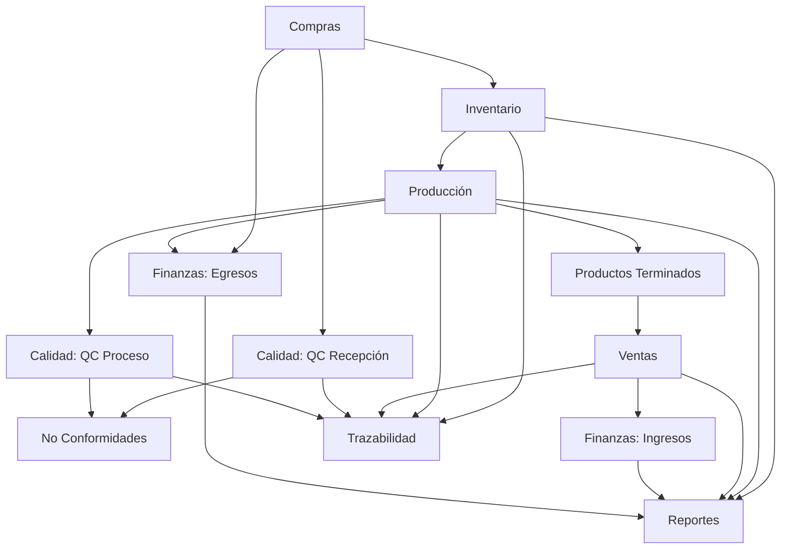

# 🔄 Funcionalidades y Flujos del Sistema - Café Gourmet

**Versión:** 1.0.0  
**Fecha:** Octubre 25, 2025  
**Documento:** Manual de Funcionalidades y Flujos Operativos

---

## 📑 Índice

1. [Flujo de Autenticación](#-1-flujo-de-autenticación)
2. [Flujo de Compras](#-2-flujo-de-compras)
3. [Flujo de Producción](#-3-flujo-de-producción)
4. [Flujo de Control de Calidad](#-4-flujo-de-control-de-calidad)
5. [Flujo de Ventas](#-5-flujo-de-ventas)
6. [Flujo de Trazabilidad](#-6-flujo-de-trazabilidad)
7. [Flujo Financiero](#-7-flujo-financiero)
8. [Flujo de Gestión de Stock](#-8-flujo-de-gestión-de-stock)
9. [Flujo de Reportes](#-9-flujo-de-reportes)
10. [Integraciones y Dependencias](#-10-integraciones-y-dependencias)

---

## 🔐 1. Flujo de Autenticación

### 1.1 Login del Usuario



### 1.2 Funcionalidades de Autenticación

#### **Login**
- **Endpoint:** `POST /api/usuario/login`
- **Input:** `{ email, password }`
- **Output:** `{ usuario: {...}, token: "jwt_token" }`
- **Proceso:**
  1. Validar formato de email y password
  2. Buscar usuario en base de datos
  3. Comparar hash de contraseña con bcrypt
  4. Generar token JWT con expiración de 24h
  5. Retornar usuario y token
  6. Frontend guarda token en localStorage

#### **Persistencia de Sesión**
- **Verificación:** Al cargar la aplicación
- **Endpoint:** `GET /api/usuario/permisos`
- **Headers:** `Authorization: Bearer {token}`
- **Proceso:**
  1. Al iniciar, mostrar "Verificando sesión..."
  2. Leer token de localStorage
  3. Si existe, hacer request a /permisos
  4. Si respuesta OK (200), restaurar sesión con rol del usuario
  5. Si error (401), limpiar localStorage y mostrar login
  6. Transición suave al dashboard o login

#### **Logout**
- **Acción:** Click en botón "Salir"
- **Proceso:**
  1. Remover token de localStorage
  2. Limpiar estado de usuario (setUser(null))
  3. Limpiar estado de token (setToken(''))
  4. Redirigir a pantalla de login
  5. Mostrar mensaje de sesión cerrada

#### **Recuperación de Contraseña**
- **Endpoint Simple:** `POST /api/usuario/reset-password-simple`
- **Input:** `{ email, nuevaPassword }`
- **Proceso:**
  1. Buscar usuario por email
  2. Hashear nueva contraseña
  3. Actualizar en base de datos
  4. Retornar confirmación
  5. Usuario puede iniciar sesión con nueva contraseña

### 1.3 Roles y Permisos

| Rol | Permisos |
|-----|----------|
| **admin** | Acceso completo a todos los módulos |
| **it** | Gestión técnica, configuración, logs |
| **rrhh** | Gestión de usuarios y roles |
| **operador** | Operaciones básicas sin eliminar |

---

## 🛒 2. Flujo de Compras

### 2.1 Diagrama de Flujo Completo



### 2.2 Funcionalidades Detalladas

#### **2.2.1 Gestión de Proveedores**

**Crear Proveedor**
- **Endpoint:** `POST /api/compras/proveedores`
- **Input:**
  ```json
  {
    "nombre": "Café Orgánico del Perú SAC",
    "ruc": "20123456789",
    "contacto": "Juan Pérez",
    "telefono": "+51 987654321",
    "direccion": "Jr. Los Cafetales 123, Lima",
    "email": "ventas@cafeorganico.pe"
  }
  ```
- **Validaciones:**
  - Nombre: requerido, mínimo 3 caracteres
  - RUC: requerido, 11 dígitos
  - Email: formato válido
  - Teléfono: requerido
- **Output:** Proveedor creado con ID único

**Listar Proveedores**
- **Endpoint:** `GET /api/compras/proveedores`
- **Filtros opcionales:** activo/inactivo
- **Output:** Array de proveedores

**Actualizar Proveedor**
- **Endpoint:** `PATCH /api/compras/proveedores/:id`
- **Permite:** Modificar cualquier campo excepto fechas de auditoría

**Eliminar Proveedor**
- **Endpoint:** `DELETE /api/compras/proveedores/:id`
- **Restricción:** Solo si no tiene OCs asociadas

---

#### **2.2.2 Órdenes de Compra (OC)**

**Crear Orden de Compra**
- **Endpoint:** `POST /api/compras/ordenes`
- **Input:**
  ```json
  {
    "proveedor": "64a1b2c3d4e5f678901234ab",
    "items": [
      {
        "tipo": "arabica",
        "cantidad": 500,
        "precioUnitario": 12.50
      },
      {
        "tipo": "robusta",
        "cantidad": 300,
        "precioUnitario": 8.75
      }
    ],
    "observaciones": "Entrega urgente para producción"
  }
  ```
- **Proceso:**
  1. Validar proveedor existe
  2. Generar código único: `OC-20251025-001`
  3. Calcular total automáticamente
  4. Estado inicial: `borrador`
  5. Guardar en base de datos
- **Output:** OC creada con código y total

**Estados de Orden de Compra**
- `borrador`: Creada pero no enviada
- `enviada`: Confirmada y enviada al proveedor
- `recibida`: Materiales recibidos completamente
- `cancelada`: Anulada antes de recibir

**Listar Órdenes**
- **Endpoint:** `GET /api/compras/ordenes`
- **Filtros:** estado, proveedor, fecha
- **Output:** Lista con datos de OC y proveedor populado

**Actualizar Estado**
- **Endpoint:** `PATCH /api/compras/ordenes/:id/estado`
- **Input:** `{ estado: "enviada" }`
- **Validación:** Transiciones válidas de estado

---

#### **2.2.3 Recepciones de Materias Primas**

**Registrar Recepción**
- **Endpoint:** `POST /api/compras/recepciones`
- **Input:**
  ```json
  {
    "ordenCompra": "64a1b2c3d4e5f678901234ab",
    "lotes": [
      {
        "tipo": "arabica",
        "cantidad": 500,
        "costoUnitario": 12.50,
        "lote": "LOTE-2025-AR-001",
        "fechaCosecha": "2025-08-15",
        "humedad": "11.5%"
      }
    ],
    "observaciones": "Recepción completa sin novedades"
  }
  ```
- **Proceso:**
  1. Validar OC existe y no está recibida
  2. Generar código de recepción único
  3. Para cada lote:
     - Crear registro de lote en inventario
     - Actualizar stock de granos
     - Registrar costos para costeo FIFO/FEFO
  4. Actualizar estado de OC a `recibida`
  5. Trigger: Notificación para QC de Recepción
- **Impacto:**
  - ✅ Inventario actualizado (+500 kg Arábica)
  - ✅ Lote disponible para QC
  - ✅ Costo registrado para análisis financiero

**Listar Recepciones**
- **Endpoint:** `GET /api/compras/recepciones`
- **Output:** Lista con OC y lotes detallados

---

## 🏭 3. Flujo de Producción

### 3.1 Diagrama de Flujo Completo



### 3.2 Funcionalidades Detalladas

#### **3.2.1 Crear Orden de Producción (OP)**

**Endpoint:** `POST /api/produccion/crear`
**Input:**
```json
{
  "producto": "Café Blend Premium 250g",
  "receta": [
    { "tipo": "arabica", "cantidad": 60 },
    { "tipo": "robusta", "cantidad": 40 }
  ]
}
```

**Proceso:**
1. Generar código único: `OP-20251025-001`
2. Validar disponibilidad de stock:
   ```javascript
   stockArabica >= 60 kg
   stockRobusta >= 40 kg
   ```
3. Si stock insuficiente → Error 400
4. Estado inicial: `pendiente`
5. Crear 3 etapas automáticamente:
   - Tostado (pendiente)
   - Molido (pendiente)
   - Empaque (pendiente)
6. Guardar en BD

**Output:**
```json
{
  "_id": "64abc...",
  "codigo": "OP-20251025-001",
  "producto": "Café Blend Premium 250g",
  "estado": "pendiente",
  "receta": [...],
  "etapas": [...]
}
```

---

#### **3.2.2 Registrar Consumo de Materias Primas**

**Endpoint:** `POST /api/produccion/:id/consumo`
**Input:**
```json
{
  "items": [
    { "tipo": "arabica", "cantidad": 60 },
    { "tipo": "robusta", "cantidad": 40 }
  ]
}
```

**Proceso:**
1. Validar OP existe y está en proceso
2. Para cada ítem:
   - Reducir stock de inventario
   - Aplicar algoritmo FIFO (First In, First Out):
     ```javascript
     // Consumir primero los lotes más antiguos
     lotes.sort((a, b) => a.fechaIngreso - b.fechaIngreso)
     consumirDeLotes(lotes, cantidad)
     ```
3. Registrar consumo en historial de OP
4. Actualizar costos de producción

**Impacto:**
- ✅ Stock reducido (-60 kg Arábica, -40 kg Robusta)
- ✅ Lotes consumidos según FIFO
- ✅ Costo de producción calculado

---

#### **3.2.3 Avanzar Etapas**

**Endpoint:** `POST /api/produccion/:id/etapa`
**Input:**
```json
{
  "etapa": "Tostado"
}
```

**Proceso:**
1. Validar etapa actual está completada
2. Actualizar estado de etapa:
   - `pendiente` → `en_proceso` → `completado`
3. Si etapa completada, siguiente pasa a `en_proceso`
4. Actualizar estado global de OP:
   - Si todas las etapas completadas → `completado`

**Estados de Etapa:**
- `pendiente`: No iniciada
- `en_proceso`: Actualmente en ejecución
- `completado`: Finalizada exitosamente

---

#### **3.2.4 Cerrar Orden de Producción**

**Endpoint:** `POST /api/produccion/:id/cerrar`
**Input:**
```json
{
  "merma": 2.5
}
```

**Proceso:**
1. Validar todas las etapas están completadas
2. Calcular producción real:
   ```javascript
   cantidadTotal = receta.reduce((sum, item) => sum + item.cantidad, 0)
   produccionReal = cantidadTotal - merma
   // Ejemplo: 100 kg - 2.5 kg = 97.5 kg
   ```
3. Crear/Actualizar producto terminado en inventario
4. Actualizar stock de productos terminados (+97.5 kg)
5. Cambiar estado de OP a `completado`
6. Registrar fecha de cierre
7. Calcular eficiencia:
   ```javascript
   eficiencia = (produccionReal / cantidadTotal) * 100
   // Ejemplo: (97.5 / 100) * 100 = 97.5%
   ```

**Output:**
- ✅ OP cerrada
- ✅ Stock PT actualizado
- ✅ Producto disponible para venta
- ✅ Métricas de eficiencia registradas

---

## ✅ 4. Flujo de Control de Calidad

### 4.1 Diagrama de Flujo



### 4.2 Funcionalidades Detalladas

#### **4.2.1 QC en Recepciones**

**Endpoint:** `POST /api/calidad/recepciones`
**Input:**
```json
{
  "recepcion": "64abc...",
  "lote": "LOTE-2025-AR-001",
  "metricas": {
    "apariencia": 9.5,
    "humedad": 8.8,
    "acidez": 9.0,
    "aroma": 9.2
  },
  "observaciones": "Excelente calidad, grano uniforme",
  "estado": "aprobado"
}
```

**Proceso:**
1. Validar recepción y lote existen
2. Registrar fecha de inspección
3. Calcular promedio de métricas:
   ```javascript
   promedio = (9.5 + 8.8 + 9.0 + 9.2) / 4 = 9.125
   ```
4. Si estado = "rechazado":
   - Crear No Conformidad automáticamente
   - Marcar lote como no disponible
   - Notificar a compras para gestión con proveedor
5. Si estado = "aprobado":
   - Lote disponible para producción

**Output:**
- ✅ Inspección registrada
- ✅ Métricas guardadas para análisis
- ✅ Estado del lote actualizado

---

#### **4.2.2 QC en Proceso (Durante Producción)**

**Endpoint:** `POST /api/calidad/proceso`
**Input:**
```json
{
  "ordenProduccion": "64abc...",
  "etapa": "Tostado",
  "metricas": {
    "temperatura": 9.0,
    "tiempo": 8.5,
    "uniformidad": 9.5,
    "sabor": 0
  },
  "observaciones": "Tostado uniforme, temperatura controlada",
  "estado": "conforme"
}
```

**Proceso:**
1. Validar OP y etapa existen
2. Registrar métricas de la etapa actual
3. Si estado = "no_conforme":
   - Crear NC vinculada a la OP
   - Pausar avance de etapa
   - Solicitar acciones correctivas
4. Si estado = "conforme":
   - Permitir avance a siguiente etapa

**Métricas por Etapa:**
- **Tostado:** temperatura, tiempo, uniformidad
- **Molido:** uniformidad, granulometría, tiempo
- **Empaque:** uniformidad, peso, sellado

---

#### **4.2.3 No Conformidades (NC)**

**Crear No Conformidad**
**Endpoint:** `POST /api/calidad/nc`
**Input:**
```json
{
  "recurso": "lote",
  "referencia": "LOTE-2025-AR-001",
  "motivo": "Humedad superior al 12% (12.8% medido)",
  "acciones": "Rechazar lote, solicitar reemplazo al proveedor"
}
```

**Proceso:**
1. Registrar fecha de apertura
2. Estado inicial: `abierta`
3. Vincular con recurso (lote u OP)
4. Generar código único: `NC-20251025-001`
5. Notificar a responsables

**Cerrar No Conformidad**
**Endpoint:** `POST /api/calidad/nc/:id/cerrar`
**Proceso:**
1. Validar acciones correctivas aplicadas
2. Registrar fecha de cierre
3. Cambiar estado a `cerrada`
4. Documentar lecciones aprendidas

---

## 💳 5. Flujo de Ventas

### 5.1 Diagrama de Flujo Completo



### 5.2 Funcionalidades Detalladas

#### **5.2.1 Gestión de Clientes**

**Crear Cliente**
**Endpoint:** `POST /api/ventas/clientes`
**Input:**
```json
{
  "nombre": "Cafetería El Aroma",
  "email": "compras@elaroma.com",
  "telefono": "+51 987123456",
  "direccion": "Av. Principal 456, Lima",
  "ruc": "20987654321",
  "tipo": "empresa"
}
```

**Validaciones:**
- Email único y formato válido
- RUC único (para empresas)
- Teléfono requerido

**Output:** Cliente creado con ID único

---

#### **5.2.2 Gestión de Productos Terminados**

**Crear Producto**
**Endpoint:** `POST /api/ventas/productos`
**Input:**
```json
{
  "sku": "CAFE-031",
  "nombre": "Arábica Orgánico Brasil #31",
  "unidad": "kg",
  "precio": 45.00,
  "stock": 0,
  "activo": true
}
```

**Características:**
- SKU único y auto-generado
- Stock inicial en 0 (se actualiza con cierre de OPs)
- Precio en soles (PEN)
- Estado activo/inactivo

---

#### **5.2.3 Crear Pedido**

**Endpoint:** `POST /api/ventas/pedidos`
**Input:**
```json
{
  "cliente": "64abc...",
  "items": [
    {
      "producto": "64def...",
      "cantidad": 50,
      "precioUnitario": 45.00
    },
    {
      "producto": "64ghi...",
      "cantidad": 30,
      "precioUnitario": 52.00
    }
  ],
  "observaciones": "Entrega urgente para evento"
}
```

**Proceso:**
1. Generar código único: `PED-20251025-001`
2. Para cada ítem:
   - Validar producto existe y está activo
   - Verificar stock disponible
   - Si stock < cantidad → Error 400
3. Reservar stock automáticamente:
   ```javascript
   producto.stock -= item.cantidad
   ```
4. Calcular totales:
   ```javascript
   subtotal = items.reduce((sum, item) => {
     return sum + (item.cantidad * item.precioUnitario)
   }, 0)
   // Ejemplo: (50 * 45) + (30 * 52) = 2,250 + 1,560 = 3,810
   ```
5. Estado inicial: `pendiente`

**Estados de Pedido:**
- `pendiente`: Creado, esperando preparación
- `preparando`: En proceso de empaque
- `enviado`: Despachado al cliente
- `entregado`: Recibido por el cliente
- `cancelado`: Anulado (devuelve stock)

**Output:**
```json
{
  "codigo": "PED-20251025-001",
  "cliente": {...},
  "items": [...],
  "subtotal": 3810.00,
  "estado": "pendiente"
}
```

---

#### **5.2.4 Generar Factura**

**Endpoint:** `POST /api/ventas/facturas`
**Input:**
```json
{
  "pedido": "64abc...",
  "items": [
    {
      "descripcion": "Arábica Orgánico Brasil #31",
      "cantidad": 50,
      "precioUnitario": 45.00,
      "descuento": 0
    }
  ],
  "metodoPago": "transferencia",
  "observaciones": "Pagado mediante transferencia bancaria"
}
```

**Proceso:**
1. Generar código único: `FAC-20251025-001`
2. Calcular montos:
   ```javascript
   subtotal = items.reduce((sum, item) => {
     const itemTotal = item.cantidad * item.precioUnitario
     const descuento = itemTotal * (item.descuento / 100)
     return sum + (itemTotal - descuento)
   }, 0)
   
   igv = subtotal * 0.18  // 18% de IGV
   total = subtotal + igv
   
   // Ejemplo:
   // subtotal = 3,810.00
   // igv = 685.80
   // total = 4,495.80
   ```
3. Vincular con pedido
4. Método de pago: efectivo, transferencia, tarjeta
5. Actualizar estado de pedido a `entregado`
6. Reducir stock definitivamente (ya estaba reservado)

**Impacto Financiero:**
- ✅ Registrar transacción de ingreso
- ✅ Categoría: "Ventas de productos"
- ✅ Monto: S/ 4,495.80

---

## 🔍 6. Flujo de Trazabilidad

### 6.1 Diagrama de Flujo



### 6.2 Funcionalidades Detalladas

#### **6.2.1 Trazabilidad por Lote**

**Endpoint:** `GET /api/trazabilidad/lote/:codigo`
**Ejemplo:** `/api/trazabilidad/lote/LOTE-2025-AR-001`

**Proceso:**
1. Buscar lote en recepciones
2. Obtener datos de recepción:
   - Fecha de ingreso
   - Proveedor
   - Cantidad recibida
   - Orden de compra origen
3. Buscar QC de Recepción del lote:
   - Métricas de calidad
   - Estado (aprobado/rechazado)
   - Observaciones
4. Buscar OPs que consumieron este lote:
   - Códigos de OP
   - Productos generados
   - Fechas de consumo
5. Para cada OP, obtener:
   - QC de Proceso
   - Estado actual
6. Buscar pedidos que contienen productos de esas OPs:
   - Clientes destino
   - Fechas de entrega

**Output (Timeline):**
```javascript
[
  {
    tipo: "recepcion",
    fecha: "2025-10-01T10:00:00Z",
    datos: {
      codigo: "LOTE-2025-AR-001",
      proveedor: "Café Orgánico del Perú",
      cantidad: 500,
      ordenCompra: "OC-20251001-001"
    },
    icono: "📦",
    color: "#3498db"
  },
  {
    tipo: "qc_recepcion",
    fecha: "2025-10-01T14:30:00Z",
    datos: {
      estado: "aprobado",
      promedio: 9.125,
      observaciones: "Excelente calidad"
    },
    icono: "🔍",
    color: "#27ae60"
  },
  {
    tipo: "produccion",
    fecha: "2025-10-05T08:00:00Z",
    datos: {
      codigoOP: "OP-20251005-001",
      producto: "Café Blend Premium 250g",
      cantidadConsumida: 60
    },
    icono: "🏭",
    color: "#f39c12"
  },
  {
    tipo: "qc_proceso",
    fecha: "2025-10-05T16:00:00Z",
    datos: {
      etapa: "Tostado",
      estado: "conforme",
      promedio: 9.0
    },
    icono: "✅",
    color: "#27ae60"
  },
  {
    tipo: "pedido",
    fecha: "2025-10-10T11:00:00Z",
    datos: {
      codigoPedido: "PED-20251010-001",
      cliente: "Cafetería El Aroma",
      cantidad: 50
    },
    icono: "🛒",
    color: "#9b59b6"
  }
]
```

**Visualización:**
- Timeline vertical con línea conectora
- Eventos ordenados cronológicamente
- Colores por tipo de evento
- Iconos descriptivos
- Información detallada en cada nodo

---

#### **6.2.2 Trazabilidad por Orden de Producción**

**Endpoint:** `GET /api/trazabilidad/op/:codigo`
**Ejemplo:** `/api/trazabilidad/op/OP-20251005-001`

**Proceso:**
1. Buscar OP por código
2. Obtener lotes consumidos (receta)
3. Para cada lote:
   - Datos de recepción
   - Proveedor origen
   - QC de Recepción
4. Obtener QC de Proceso de la OP:
   - Por etapa (Tostado, Molido, Empaque)
   - Métricas y conformidades
5. Buscar pedidos que incluyen el producto:
   - Clientes
   - Cantidades
   - Estado de entrega

**Output:** Timeline similar con foco en la OP

---

## 💰 7. Flujo Financiero

### 7.1 Diagrama de Flujo



### 7.2 Funcionalidades Detalladas

#### **7.2.1 Registrar Transacción**

**Endpoint:** `POST /api/finanzas/transacciones`
**Input (Ingreso):**
```json
{
  "tipo": "ingreso",
  "categoria": "Ventas de productos",
  "monto": 4495.80,
  "metodoPago": "transferencia",
  "concepto": "Factura FAC-20251025-001",
  "descripcion": "Venta a Cafetería El Aroma",
  "fecha": "2025-10-25T14:30:00Z"
}
```

**Input (Egreso):**
```json
{
  "tipo": "egreso",
  "categoria": "Compra de materias primas",
  "monto": 6875.00,
  "metodoPago": "transferencia",
  "concepto": "OC-20251020-001",
  "descripcion": "Compra de 500kg Arábica a Café Orgánico del Perú",
  "fecha": "2025-10-20T10:00:00Z"
}
```

**Categorías Predefinidas:**
- **Ingresos:** Ventas de productos, Servicios, Otros ingresos
- **Egresos:** Compra de materias primas, Salarios, Servicios, Mantenimiento, Otros gastos

**Métodos de Pago:**
- Efectivo
- Transferencia bancaria
- Tarjeta de crédito
- Tarjeta de débito

---

#### **7.2.2 Gestión de Presupuestos**

**Crear Presupuesto**
**Endpoint:** `POST /api/finanzas/presupuestos`
**Input:**
```json
{
  "categoria": "Compra de materias primas",
  "monto": 50000.00,
  "periodo": "2025-10",
  "descripcion": "Presupuesto mensual para compras de octubre"
}
```

**Verificación Automática:**
```javascript
// Al registrar transacción de egreso
const presupuesto = await Presupuesto.findOne({
  categoria: transaccion.categoria,
  periodo: "2025-10"
})

const gastadoEnMes = await Transaccion.aggregate([
  {
    $match: {
      tipo: "egreso",
      categoria: transaccion.categoria,
      fecha: { $gte: new Date("2025-10-01"), $lte: new Date("2025-10-31") }
    }
  },
  { $group: { _id: null, total: { $sum: "$monto" } } }
])

if (gastadoEnMes[0].total > presupuesto.monto) {
  // Alertar: ⚠️ Presupuesto excedido
}
```

---

#### **7.2.3 Calcular Balance**

**Endpoint:** `GET /api/finanzas/balance`
**Query Parameters:** `?fechaInicio=2025-10-01&fechaFin=2025-10-31`

**Proceso:**
```javascript
const ingresos = await Transaccion.aggregate([
  {
    $match: {
      tipo: "ingreso",
      fecha: { $gte: fechaInicio, $lte: fechaFin }
    }
  },
  { $group: { _id: null, total: { $sum: "$monto" } } }
])

const egresos = await Transaccion.aggregate([
  {
    $match: {
      tipo: "egreso",
      fecha: { $gte: fechaInicio, $lte: fechaFin }
    }
  },
  { $group: { _id: null, total: { $sum: "$monto" } } }
])

const balance = ingresos[0].total - egresos[0].total
```

**Output:**
```json
{
  "periodo": "Octubre 2025",
  "ingresos": 125430.50,
  "egresos": 89765.30,
  "balance": 35665.20,
  "desglose": {
    "ingresosPorCategoria": [...],
    "egresosPorCategoria": [...]
  }
}
```

---

## 📦 8. Flujo de Gestión de Stock

### 8.1 Diagrama de Flujo



### 8.2 Funcionalidades Detalladas

#### **8.2.1 Dashboard de Stock**

**Visualización:**
```javascript
// KPI 1: Total Productos
const totalProductos = await Producto.countDocuments()

// KPI 2: Productos Activos
const productosActivos = await Producto.countDocuments({ activo: true })

// KPI 3: Productos Bajo Stock
const productosBajoStock = await Producto.countDocuments({
  activo: true,
  stock: { $lt: 10 }
})

// KPI 4: Stock Total
const stockTotal = await Producto.aggregate([
  { $group: { _id: null, total: { $sum: "$stock" } } }
])
```

**Cards con Gradientes:**
- Morado: Total Productos
- Verde: Productos Activos
- Rojo: Bajo Stock (alerta)
- Rosa: Stock Total

---

#### **8.2.2 Alertas de Stock Bajo**

**Lógica:**
```javascript
// Producto con stock < 10
if (producto.stock < 10) {
  // Resaltar en rojo en tabla
  backgroundColor = "#fff3e0"
  badge = {
    text: producto.stock,
    color: "#e74c3c",  // Rojo
    fontWeight: "bold"
  }
  
  // Notificación al sistema
  notificar({
    tipo: "warning",
    mensaje: `Stock bajo: ${producto.nombre} (${producto.stock} unidades)`
  })
}
```

---

#### **8.2.3 Registrar Movimiento Manual**

**Endpoint:** `POST /api/inventario/movimientos` (Conceptual)
**Input:**
```json
{
  "producto": "64abc...",
  "tipo": "entrada",
  "cantidad": 50,
  "motivo": "Ajuste de inventario físico",
  "referencia": "INV-2025-10-25"
}
```

**Tipos de Movimiento:**
- **Entrada:** Incrementa stock (+cantidad)
- **Salida:** Reduce stock (-cantidad)
- **Ajuste:** Corrección manual (puede ser +/-)

**Proceso:**
1. Validar producto existe
2. Validar cantidad > 0
3. Según tipo:
   ```javascript
   if (tipo === "entrada") {
     producto.stock += cantidad
   } else if (tipo === "salida") {
     producto.stock -= cantidad
   } else if (tipo === "ajuste") {
     producto.stock = nuevaCantidad
   }
   ```
4. Guardar movimiento en historial
5. Actualizar producto

**Output:** Confirmación de movimiento registrado

---

## 📊 9. Flujo de Reportes

### 9.1 Tipos de Reportes

#### **9.1.1 Reporte de Inventario**

**Endpoint:** `GET /api/reportes/inventario`
**Output:**
```json
{
  "fecha": "2025-10-25",
  "stockActual": [
    {
      "tipo": "arabica",
      "cantidad": 450,
      "valor": 5625.00,
      "lotes": 3
    },
    {
      "tipo": "robusta",
      "cantidad": 280,
      "valor": 2450.00,
      "lotes": 2
    }
  ],
  "alertas": [
    {
      "tipo": "robusta",
      "stock": 280,
      "minimo": 300,
      "alerta": "Stock bajo el mínimo"
    }
  ],
  "valorTotal": 8075.00
}
```

---

#### **9.1.2 Reporte de Producción**

**Endpoint:** `GET /api/reportes/produccion`
**Query:** `?fechaInicio=2025-10-01&fechaFin=2025-10-31`
**Output:**
```json
{
  "periodo": "Octubre 2025",
  "ordenesPorEstado": {
    "pendiente": 5,
    "proceso": 8,
    "completado": 42,
    "cancelado": 2
  },
  "eficienciaPromedio": 96.8,
  "mermaTotal": 125.5,
  "consumoPorTipo": {
    "arabica": 2500,
    "robusta": 1800
  },
  "produccionTotal": 4250
}
```

---

#### **9.1.3 Reporte de Ventas**

**Endpoint:** `GET /api/reportes/ventas`
**Query:** `?fechaInicio=2025-10-01&fechaFin=2025-10-31`
**Output:**
```json
{
  "periodo": "Octubre 2025",
  "ventasTotales": 125430.50,
  "pedidosEntregados": 87,
  "topProductos": [
    {
      "producto": "Café Blend Premium 250g",
      "cantidad": 450,
      "monto": 45000.00
    }
  ],
  "topClientes": [
    {
      "cliente": "Cafetería El Aroma",
      "pedidos": 15,
      "monto": 28450.00
    }
  ],
  "crecimiento": "+15.3%"
}
```

---

#### **9.1.4 Reporte de Calidad**

**Endpoint:** `GET /api/reportes/calidad`
**Output:**
```json
{
  "periodo": "Octubre 2025",
  "inspeccionesRecepcion": 25,
  "aprobadas": 23,
  "rechazadas": 2,
  "tasaAprobacion": 92.0,
  "inspeccionesProceso": 42,
  "conformes": 40,
  "noConformes": 2,
  "ncAbiertas": 3,
  "ncCerradas": 8,
  "promedioMetricas": {
    "apariencia": 9.2,
    "humedad": 8.9,
    "acidez": 9.0,
    "aroma": 9.1
  }
}
```

---

## 🔗 10. Integraciones y Dependencias

### 10.1 Mapa de Dependencias



### 10.2 Eventos y Triggers

#### **Evento: Recepción Creada**
**Trigger:**
- ✅ Actualizar inventario de granos
- ✅ Crear notificación para QC de Recepción
- ✅ Registrar transacción financiera (egreso)
- ✅ Actualizar estado de OC a "recibida"

#### **Evento: OP Cerrada**
**Trigger:**
- ✅ Actualizar stock de productos terminados
- ✅ Crear/Actualizar producto en catálogo
- ✅ Registrar consumo de materias primas
- ✅ Calcular eficiencia y mermas
- ✅ Disponibilizar para ventas

#### **Evento: Pedido Confirmado**
**Trigger:**
- ✅ Reservar stock automáticamente
- ✅ Crear tarea de preparación
- ✅ Notificar a almacén

#### **Evento: Factura Generada**
**Trigger:**
- ✅ Reducir stock definitivamente
- ✅ Registrar transacción de ingreso
- ✅ Actualizar estado de pedido a "entregado"
- ✅ Enviar email al cliente (futuro)

#### **Evento: QC Rechazado**
**Trigger:**
- ✅ Crear No Conformidad automáticamente
- ✅ Marcar lote/OP como bloqueado
- ✅ Notificar a responsables
- ✅ Solicitar acciones correctivas

---

## 🎯 11. Casos de Uso Completos

### Caso de Uso 1: Desde Compra hasta Venta

**Escenario:** Cafetería solicita 50 kg de Café Blend Premium

**Pasos:**
1. **Compras:**
   - Crear proveedor "Café del Perú"
   - Crear OC con 500 kg Arábica + 300 kg Robusta
   - Enviar OC al proveedor
   
2. **Recepción:**
   - Proveedor despacha
   - Registrar recepción con lotes
   - Inventario se actualiza (+500 kg Arábica, +300 kg Robusta)
   
3. **Calidad - Recepción:**
   - QC inspecciona lotes
   - Registrar métricas (apariencia, humedad, etc.)
   - Estado: Aprobado
   - Lotes disponibles para producción
   
4. **Producción:**
   - Crear OP para "Café Blend Premium"
   - Receta: 60% Arábica + 40% Robusta
   - Registrar consumo (60 kg + 40 kg)
   - Inventario se reduce (-60 kg Arábica, -40 kg Robusta)
   
5. **Calidad - Proceso:**
   - QC en etapa Tostado: Conforme
   - QC en etapa Molido: Conforme
   - QC en etapa Empaque: Conforme
   
6. **Cierre de Producción:**
   - Cerrar OP con merma de 2 kg
   - Producción real: 98 kg
   - Stock de productos terminados +98 kg
   
7. **Ventas:**
   - Cliente "Cafetería El Aroma" solicita 50 kg
   - Crear pedido con 50 kg
   - Stock reservado (98 - 50 = 48 kg disponibles)
   - Preparar y despachar pedido
   
8. **Facturación:**
   - Generar factura FAC-20251025-001
   - Subtotal: S/ 2,250.00
   - IGV: S/ 405.00
   - Total: S/ 2,655.00
   - Stock definitivamente reducido (48 kg)
   
9. **Finanzas:**
   - Registrar ingreso: S/ 2,655.00
   - Categoría: Ventas de productos
   - Método: Transferencia
   
10. **Trazabilidad:**
    - Cliente puede consultar:
      * Lote de origen: LOTE-2025-AR-001
      * Proveedor: Café del Perú
      * Fecha de recepción: 2025-10-01
      * OP que lo procesó: OP-20251005-001
      * QC de recepción: Aprobado (9.125)
      * QC de proceso: Conforme (9.0)
      * Fecha de entrega: 2025-10-25

---

### Caso de Uso 2: Gestión de No Conformidad

**Escenario:** Lote de Robusta llega con humedad alta

**Pasos:**
1. **Recepción:**
   - Registrar recepción de 300 kg Robusta
   - Lote: LOTE-2025-RO-002
   
2. **QC Recepción:**
   - Inspeccionar lote
   - Medición de humedad: 13.2% (límite: 12%)
   - Estado: Rechazado
   - Observaciones: "Humedad excesiva"
   
3. **No Conformidad Automática:**
   - Sistema crea NC-20251025-001
   - Recurso: lote
   - Referencia: LOTE-2025-RO-002
   - Motivo: "Humedad superior al límite (13.2%)"
   - Estado: Abierta
   
4. **Acciones Correctivas:**
   - Compras contacta al proveedor
   - Se solicita reemplazo del lote
   - Lote bloqueado para producción
   
5. **Nuevo Lote:**
   - Proveedor envía reemplazo
   - Nuevo lote: LOTE-2025-RO-003
   - QC aprueba: Humedad 11.5%
   
6. **Cierre de NC:**
   - Registrar resolución en NC-20251025-001
   - Acciones: "Lote reemplazado satisfactoriamente"
   - Estado: Cerrada
   - Fecha de cierre: 2025-10-28

---

## 📱 12. Interfaz de Usuario - Navegación

### 12.1 Estructura del Menú

**Categoría: Operaciones**
- 🏠 Inicio / Dashboard
- 📦 Inventario de Granos
- 🛒 Compras (Proveedores, OC, Recepciones)
- 💡 Sugerencias Inteligentes
- 🏭 Producción (OPs, Etapas)
- ✅ Calidad (QC Recepción, QC Proceso, NC)
- 💳 Ventas (Clientes, Productos, Pedidos, Facturas)
- 🔍 Trazabilidad (Por Lote, Por OP)
- 📦 Stock de Productos Terminados

**Categoría: Gestión**
- 💼 Finanzas (Transacciones, Presupuestos, Balance)
- 📊 Reportes (Inventario, Producción, Ventas, Calidad)

**Categoría: Sistema**
- 📈 Observabilidad (Monitoreo del sistema)
- ⚙️ Configuración (Usuarios, Preferencias, Temas)
- ↶ Undo (Deshacer acciones)

### 12.2 Búsqueda Rápida (Ctrl+F)

**Funcionalidad:**
- Presionar Ctrl+F en cualquier momento
- Modal de búsqueda aparece
- Buscar módulos por nombre: "inventario", "ventas", "calidad"
- Navegar con flechas ↑ ↓
- Enter para abrir módulo seleccionado
- Escape para cerrar

---

## 🔒 13. Seguridad y Validaciones

### 13.1 Validaciones de Negocio

**Inventario:**
- ✅ No permitir cantidades negativas
- ✅ Validar tipo de grano existe (arabica, robusta, blend)
- ✅ Proveedor debe estar registrado

**Producción:**
- ✅ Stock suficiente antes de crear OP
- ✅ Receta debe tener al menos 1 ingrediente
- ✅ No cerrar OP sin completar todas las etapas
- ✅ Merma no puede ser mayor que producción total

**Compras:**
- ✅ OC debe tener al menos 1 ítem
- ✅ Precio unitario > 0
- ✅ No recibir más de la cantidad ordenada
- ✅ RUC único por proveedor

**Ventas:**
- ✅ Stock disponible antes de confirmar pedido
- ✅ Cliente debe existir y estar activo
- ✅ Precio unitario > 0
- ✅ IGV calculado correctamente (18%)

**Calidad:**
- ✅ Métricas entre 0 y 10
- ✅ No cerrar NC sin acciones correctivas documentadas
- ✅ QC debe estar vinculado a lote u OP válido

### 13.2 Seguridad de Datos

**Headers HTTP:**
```javascript
// Helmet middleware
helmet.contentSecurityPolicy()
helmet.xssFilter()
helmet.noSniff()
helmet.frameguard({ action: 'deny' })
```

**Rate Limiting:**
```javascript
// Login endpoint
const loginLimiter = rateLimit({
  windowMs: 5 * 60 * 1000,  // 5 minutos
  max: 50  // 50 intentos máximo
})
```

**Validación con Joi:**
```javascript
const schema = Joi.object({
  email: Joi.string().email().required(),
  password: Joi.string().min(8).required(),
  nombre: Joi.string().min(3).max(100).required()
})
```

---

## 📝 14. Conclusiones

Este sistema integra **10 módulos principales** con **flujos end-to-end** que cubren toda la cadena de valor del negocio de café gourmet:

1. ✅ **Trazabilidad completa:** Desde lote de origen hasta cliente final
2. ✅ **Calidad garantizada:** QC en recepción y proceso con NCs automáticas
3. ✅ **Control financiero:** Transacciones, presupuestos y balances en tiempo real
4. ✅ **Gestión de stock:** Alertas automáticas y movimientos trazados
5. ✅ **Producción eficiente:** OPs con etapas y cálculo de eficiencia
6. ✅ **Ventas integradas:** Desde pedido hasta factura con reserva de stock
7. ✅ **Reportes analíticos:** KPIs y métricas de todos los módulos
8. ✅ **Seguridad robusta:** JWT, roles, validaciones y rate limiting
9. ✅ **UX moderna:** Temas personalizables, sidebar colapsable, búsqueda rápida
10. ✅ **Arquitectura escalable:** Patrones de diseño, código modular, API REST

**Estado:** Sistema 100% funcional y listo para producción  
**Última actualización:** Octubre 25, 2025

---

**Desarrollado con ☕ y mucho código**
